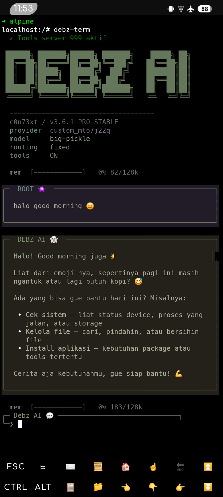
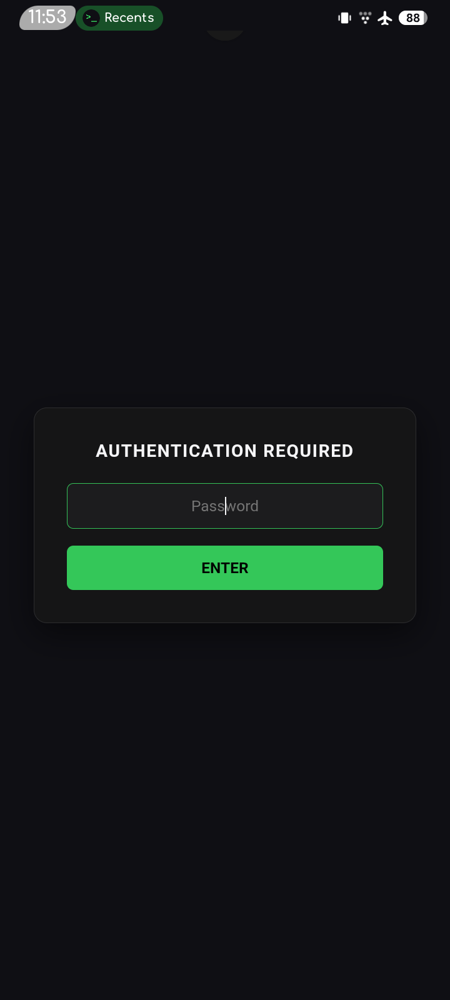
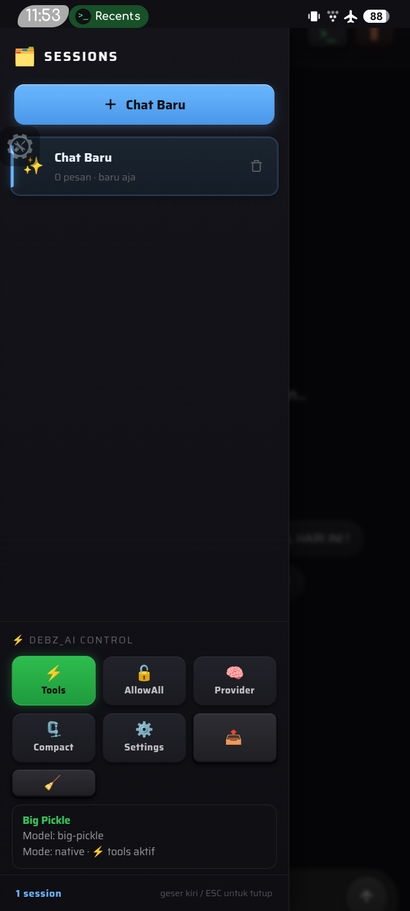
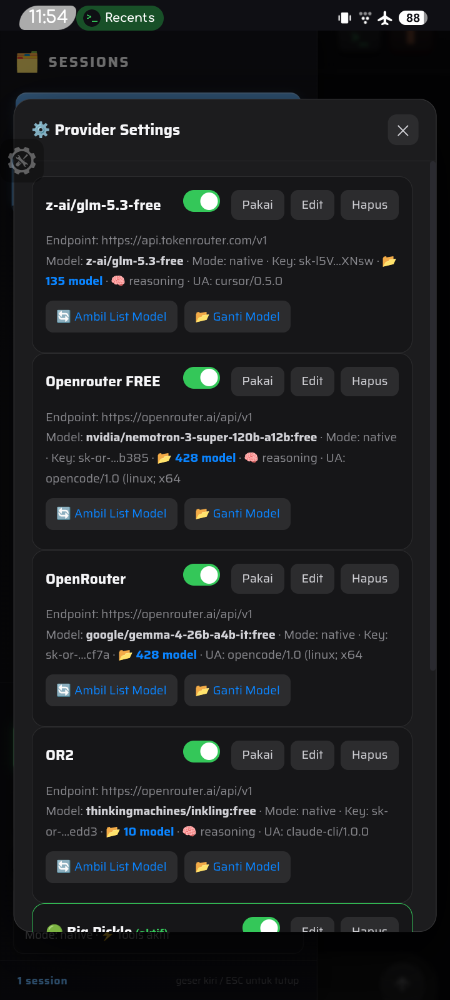
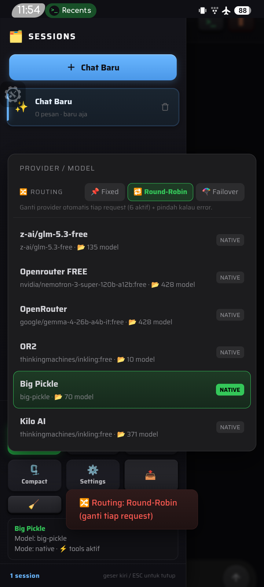
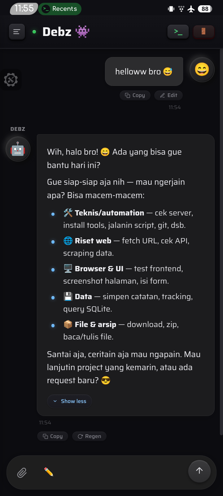

# 🤖 Debz AI — c0n73xt Platform Agent

AI agent mandiri yang bisa diajak ngobrol sekaligus **jalanin perintah** (shell, file, browser) lewat satu terminal. Lengkap dengan **WebUI**, **CLI**, dan **server tools** — semua jalan di mesin kamu sendiri.

> 🌟 **100% Open Source** — bebas dipakai, dimodifikasi, dan di-recoding ulang sesuai kebutuhan kamu. Nggak ada lisensi tertutup, nggak ada biaya. Kalau project ini bermanfaat, boleh banget support developer lewat tombol di bawah. 🙏

<div align="center">

[](https://saweria.co/debzroot)

</div>

---

## 📸 Screenshot

Tampilan WebUI (mode mobile/HP — di desktop juga bisa, tinggal buka di browser):

<div align="center">

| | | |
|:---:|:---:|:---:|
|  |  |  |
|  |  |  |

</div>

---

## ✨ Fitur

- 💬 **Chat AI** — pakai provider OpenAI-compatible apa aja (OpenRouter, OpenAI, Groq, Ollama lokal, dll)
- 🛠️ **Agent + Tools** — bisa eksekusi shell, baca/tulis file, buka browser, otomatis
- 🌐 **WebUI** di `http://127.0.0.1:8080` — buat chat & atur konfigurasi
- 💻 **CLI terminal** (`debz-term`) — buat yang lebih nyaman di terminal
- 🔄 **Multi-provider** — bisa set beberapa provider + routing (fixed / round-robin / failover)
- 📦 **Auto-install** — sekali jalanin `./debz.sh`, semua dependency kepasang otomatis
- 🐛 **Eruda overlay** — console & debugger mobile langsung di WebUI, tinggal tap tombol
- 🔒 **Password protected** — WebUI aman, password bisa diganti sendiri di `index.php`

---

## 🚀 Quick Start

Pilih salah satu cara download di bawah ini, lalu jalanin `./debz.sh`.

### Cara 1 — Git Clone (HTTPS) ⭐ paling umum

```bash
git clone https://github.com/debzroot/Debz-AI-Agent.git debz_ai
cd debz_ai
./debz.sh
```

### Cara 2 — Download ZIP (tanpa git, paling gampang)

Buka link ini di browser, langsung ke-download:

```
https://github.com/debzroot/Debz-AI---Agent/archive/refs/heads/main.zip
```

Lalu:
1. **Extract** file `main.zip` → jadi folder `Debz-AI---Agent-main`
2. Rename jadi `debz_ai` (biar rapi):
   ```bash
   mv Debz-AI---Agent-main debz_ai
   ```
3. Masuk folder & jalankan:
   ```bash
   cd debz_ai
   ./debz.sh
   ```

> 💡 **Cara 2 alternatif**: buka halaman repo di GitHub → klik tombol hijau **`<> Code`** → pilih **Download ZIP**.

> 🔑 **Buat yang suka SSH**: `git clone git@github.com:debzroot/Debz-AI---Agent.git debz_ai` (perlu SSH key terdaftar dulu di GitHub).

---

### ▶️ Setelah download, tinggal jalanin:

```bash
cd debz_ai
./debz.sh
```

Script `debz.sh` otomatis:
1. Install dependency sistem (PHP, Python3, Node, Chromium) sesuai distro kamu
2. Setup virtualenv Python + dependency
3. Pasang command `debz-term` ke PATH
4. Start semua service

**Output kalau sukses:**

```
  🌐 WebUI      → http://127.0.0.1:8080
  💻 CLI        → ketik debz-term
  ⚙️ Konfigurasi → API key & model diatur lewat WebUI (tombol ⚙️ Settings)
  🛠️ Tool server → http://127.0.0.1:9090
```

## 📱 Jalan di Termux (Android)

Debz AI bisa dijalanin langsung dari **Termux** di HP Android. Replace beberapa file dalam direktori /debz_ai dengan file fixed yang ada di **PATCH FOR ANDROID** (Wajib)
karena file bawaan tested di alpine linux, path jelas beda dengan termux. dan karena playwright-core ga support di android maka menggunakan Browser CDN adalah solusi terbaik. 👾
mendeteksi Termux dan pakai nama paket yang benar (`pkg`, bukan `apt`).

```bash
pkg install git -y
git clone https://github.com/debzroot/Debz-AI-Agent.git debz_ai
cd debz_ai
./debz.sh
```

> 📌 **Catatan Termux:**
> - Kalau `./debz.sh` nggak bisa dieksekusi, jalankan `bash debz.sh`.
> - Di Termux, dependency Python diinstall langsung ke system (tanpa venv) biar lebih ringan & cepat.
> - Gagal pasang cua_driver? install manual dengan command : curl -fsSL https://cua.ai/driver/install.sh | bash -s -- --channel nightly


## ⚙️ Setup Pertama Kali (WAJIB)

Setelah clone & start, project masih **belum punya API key** (default kosong, aman). Isi dulu biar bisa dipakai:

1. Buka **http://127.0.0.1:8080** di browser
2. Klik tombol **⚙️ Settings** (menu sidebar)
3. Di kartu provider **OpenRouter (default)**:
   - **API Key** → isi key kamu (buat di [openrouter.ai/keys](https://openrouter.ai/keys) — gratis)
   - **Model** → pilih model, misal `openai/gpt-4o-mini`, atau klik **📂 Model** buat lihat daftar
   - Klik **Test Koneksi** dulu buat mastiin berhasil
   - Klik **Simpan**
4. Balik ke halaman chat, langsung bisa dipakai ✅
5. jika error 400, coba generate X-Session-ID dari menu edit provider.

> 💡 **Bisa pakai provider lain juga** — di Settings, klik **+ Tambah Provider**, isi Base URL + API key + model. Yang penting endpoint-nya OpenAI-compatible (format `/v1`). Misal: OpenAI, Groq, Ollama lokal, atau server AI sendiri.

---

## 🔑 Ganti Password WebUI

Password default WebUI "123456" silahkan ganti sesuai keinginan di **`index.php`**, baris paling atas:

```php
define('AUTH_PASSWORD', 'ganti-ini-password-kamu');
```

Cara ganti:
1. Buka `index.php` pakai editor teks
2. Cari baris `define('AUTH_PASSWORD', '...')`
3. Ganti isinya dengan password baru kamu
4. Simpan, lalu restart: `./debz.sh stop && ./debz.sh start`

> ⚠️ **Jangan commit perubahan ini** kalau password-nya rahasia — file `index.php` itu ikut ter-versioning. Kalau mau, bisa diganti setelah clone.

---

## 🐛 Eruda Overlay (Debug Mobile)

WebUI udah dibekali **Eruda** — console, network, dan DOM inspector ala DevTools browser, tapi jalan di dalam halaman (cocok buat akses dari HP).

- Muncul sebagai tombol **floating** di sisi kanan bawah layar bisa di geser bebas tata letaknya.
- Tap buat buka panel: Console, Elements, Network, Resources, Sources, dan lainnya
- Berguna banget buat debugging JS WebUI langsung dari HP

---

## 💻 CLI Terminal

```bash
debz-term
```

Perintah penting di CLI:

| Perintah | Fungsi |
|---|---|
| `/model` | Ganti provider/model |
| `/tools on` atau `/tools off` | Aktifkan / nonaktifkan tools |
| `/allow on` / `/allow off` | Auto-approve perintah berbahaya |
| `!<perintah>` | Jalanin shell langsung (via tool server) |
| `/save` / `/load` | Simpan / muat session |
| `/export` | Export chat ke Markdown |
| `/retry` | Ulangi request yang di-hold |
| `/reset` / `/new` | Reset session |

Contoh non-interaktif:
```bash
debz-term --exec "buatkan script python untuk backup folder" --json
```

---

## 📖 Perintah `debz.sh`

| Perintah | Fungsi |
|---|---|
| `./debz.sh` / `./debz.sh start` | Install dependency (kalau perlu) + start semua service |
| `./debz.sh install` | Install dependency aja (tanpa start) |
| `./debz.sh stop` | Stop semua service |
| `./debz.sh status` | Cek status semua service |
| `./debz.sh term` | Jalankan CLI terminal |
| `./debz.sh help` | Bantuan |

---

## 🧩 Komponen

| Komponen | File | Port |
|---|---|---|
| WebUI | `index.php` (PHP built-in server) | **8080** |
| Tool server | `backend.py` (Flask) | **9090** |
| CLI terminal | `debz-term.py` (Rich + prompt_toolkit) | — |
| Browser daemon | `pw_daemon.mjs` (Playwright + Chromium) | **9222** |

---

## ⚙️ Cara Kerja Konfigurasi

Ada 2 file config:

| File | Isi | Cara atur |
|---|---|---|
| `.ai-providers.json` | Provider + API key + model (yang utama) | **WebUI Settings** (paling gampang) |
| `.ai-config.ini` | Token tool server, port, max token | Edit manual / WebUI |

- Saat clone pertama, kedua file **otomatis dibuat dari `.example`** oleh `./debz.sh`, jadi langsung jalan.

---

## 🛑 Stop & Status

```bash
./debz.sh status   # cek semua service
./debz.sh stop     # matiin semua service
```

---

## 🧪 Requirement

- Linux (Alpine / Debian / Ubuntu / Fedora) atau **Termux** (Android) — script auto-detect
- PHP CLI 8+, Python 3.10+, Node 18+ (buat browser daemon), Chromium (opsional)
- Koneksi internet saat install pertama

---

## 🔒 Catatan Keamanan

- Tool server (`backend.py`) punya filter perintah berbahaya (`rm -rf /`, `dd`, `mkfs`, dll) — butuh approval eksplisit
- WebUI punya proteksi password + rate-limit login
- Ganti `AI_TOOLS_TOKEN` di `.ai-config.ini` sebelum dipakai di jaringan publik

---

## 🛠️ Troubleshooting

**WebUI kebuka tapi chat error "AI_API_KEY not configured"?**
→ Belum diisi API key. Ikuti langkah **Setup Pertama Kali** di atas.

**`debz-term: command not found`?**
→ Jalankan `./debz.sh` dulu (biar command kepasang ke PATH), atau pakai `./debz.sh term`.

**Tool server nggak start?**
→ Cek `logs/backend.log`. Biasanya karena `AI_TOOLS_TOKEN` kosong di `.ai-config.ini`.

**Browser daemon off?**
→ Itu normal kalau Node/Playwright nggak ada — fitur browser aja yang nonaktif, chat & tools tetap jalan.

---

## 🧠 Open Source & Bebas Recode

Project ini **open source penuh** — kamu bebas:
- ✏️ **Recode / modifikasi** sesuai kebutuhan
- 🔀 **Fork & deploy** di server sendiri
- 📚 **Belajar** dari struktur kodenya

Kalau ada yang kurang atau mau request fitur, silakan buka issue. Dan kalau project ini kepake & membantu, support developer biar makin semangat ngembangin:

<div align="center">

### ☕ Support Developer

[](https://saweria.co/debzroot)

**https://saweria.co/debzroot**

</div>
